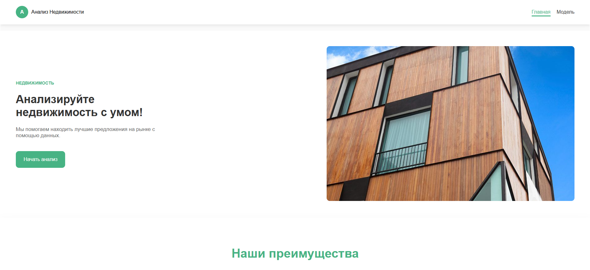
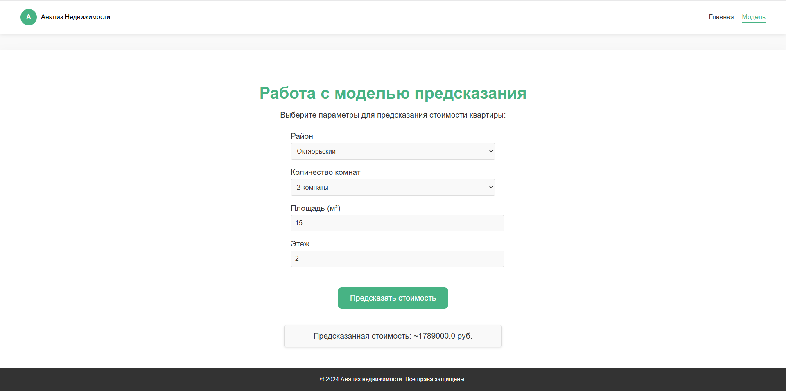

# 🏠 HouseHunt

**HouseHunt** - это проект, который поможет вам узнать стоимость квартир в Ростове-на-Дону, указав подходящие для вас параметры!

---

## 📸 Превью

- **[Главный экран](https://dimagdd.github.io/HouseHunt/index.html)**

  

- **[Экран с моделью](https://dimagdd.github.io/HouseHunt/model.html)**

  

- **Telegram бот**: [@Houses_Hunters_Bot](https://t.me/Houses_Hunters_Bot)

---

## 📂 Структура проекта

1. [**`main`**](https://github.com/DimaGDD/HouseHunt) - Основная ветка, где хранится рабочая версия проекта.  
2. В других ветках лежат скрипты и экспериментальные функции для доработки проекта. Эти ветки могут быть не всегда стабильны.
   - [**`neuron`**](https://github.com/DimaGDD/HouseHunt/tree/neuron) - модель
   - [**`parser`**](https://github.com/DimaGDD/HouseHunt/tree/parser) - парсер
   - [**`tg_bot`**](https://github.com/DimaGDD/HouseHunt/tree/tg_bot) - телеграм бот
   - [**`web_site`**](https://github.com/DimaGDD/HouseHunt/tree/web_site) - сайт
4. Дополнительная информация о каждой ветке находится в её собственном `README.md`.

---

## 🚀 Установка и запуск

1. **Склонируйте репозиторий**:
   ```bash
   git clone https://github.com/ваш_репозиторий.git
